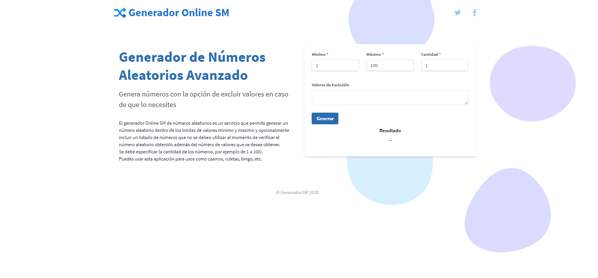

# Generador SM

Proyecto desarrollado para elaborar un generador de números aleatorios con un valor mínimo, máximo, número de valores solicitados y las opciones de exclusión que no son requeridas.

## Versión

> 1.0.0 con Vanilla JS

## Imágenes

## Autor

> Stalin Maza
